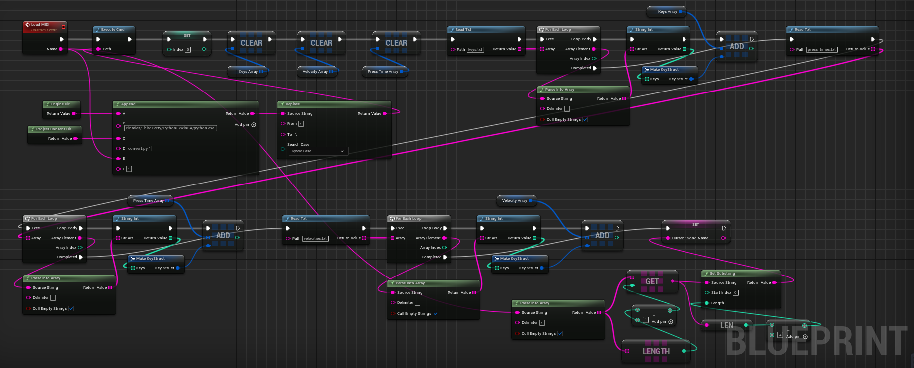
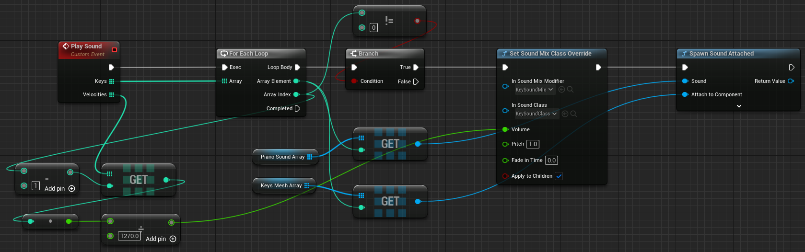
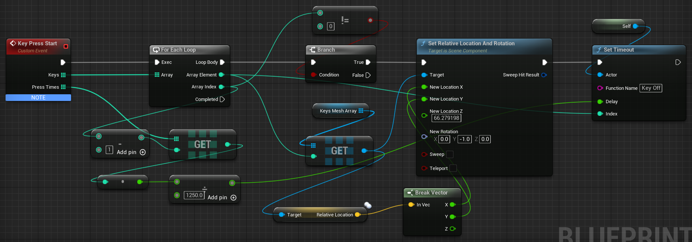
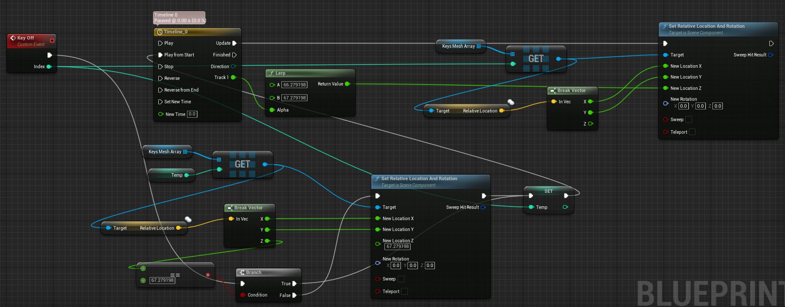
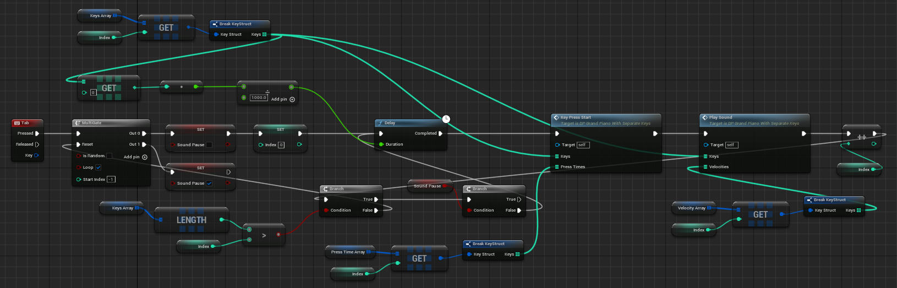
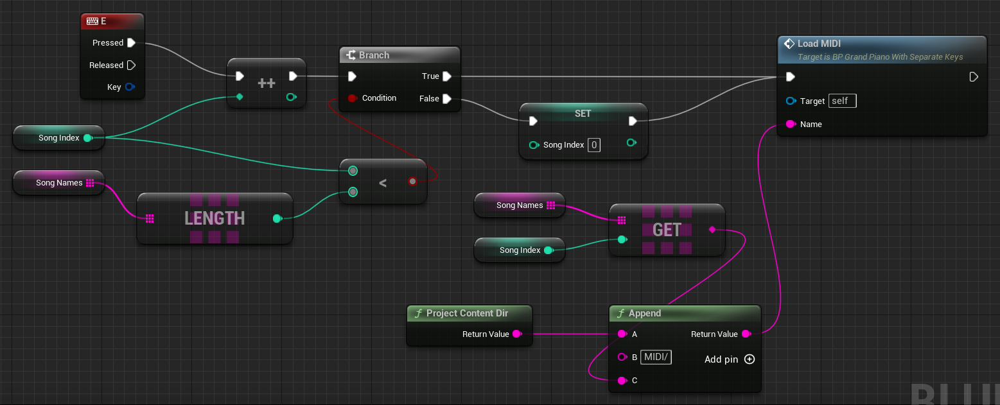
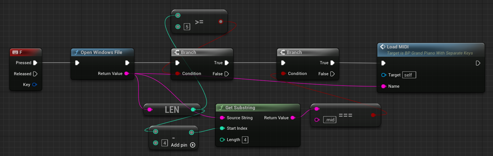
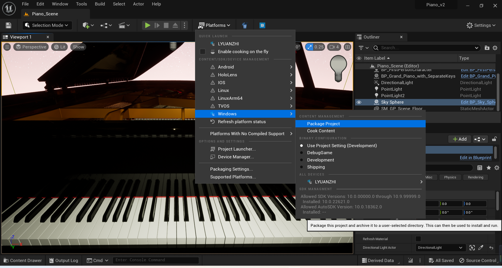

# PianoUE5
A piano game created with Unreal Engine 5 for piano teaching. This piano can play any piece based on the key information from MIDI files, including dynamics, duration, and more.

## Tech Stack
1. Unreal Engine 5
2. C++
3. Python

## Usage
1. clone the repo
2. unzip ```WindowsApp.zip```
3. run ```Piano_v2.exe```
##### Note: Because I used ```GitHub LFS (Large File Storage)``` for ```WindowsApp.zip```, downloading the zip directly will not include ```WindowsApp.zip```.

## Dependencies
1. Unreal Engine 5.1.1

## Design
### Load MIDI File

##### Here, the MIDI file will be parsed by ```convert.py```, and then be read by UE5.

### Play Sound


### Press Key Animation



### Play / Pause Songs


### Switch Songs


### Select Songs From File Manager


## Package Project


## Demo Screenshots

